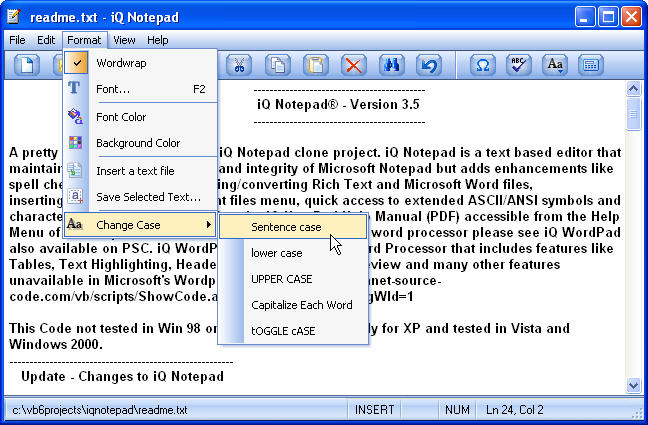



## iQ Notepad  \(Update 11 Oct 2007\)

### Description

A pretty significant update to the iQ Notepad clone project. iQ Notepad is a text based editor that maintains the basic functionality and integrity of Microsoft Notepad but adds enhancements like spell check, change case, importing/converting Rich Text and Microsoft Word files, inserting/appending files, a recent files menu, quick access to extended ASCII/ANSI symbols and characters, a toolbar and more. See the iQ NotePad Help Manual (PDF) accessible from the Help Menu of iQ Notepad. For those looking for a full featured word processor please see iQ WordPad also available on PSC. iQ WordPad is an easy to use Word Processor that includes features like Tables, Text Highlighting, Headers and Footers, Print Preview and many other features unavailable in Microsoft's Wordpad. Go to http://www.planet-source-code.com/vb/scripts/ShowCode.asp?txtCodeId=69067&amp;lngWId=1
 
### More Info
 
None that I'm aware of.

             |
---                |---
**Submitted On**   |2007-10-10 22:40:06
**By**             |[Tom Moran](https://github.com/Planet-Source-Code/PSCIndex/blob/master/ByAuthor/tom-moran.md)
**Level**          |Intermediate
**User Rating**    |4.8 (43 globes from 9 users)
**Compatibility**  |VB 6\.0
**Category**       |[Complete Applications](https://github.com/Planet-Source-Code/PSCIndex/blob/master/ByCategory/complete-applications__1-27.md)
**World**          |[Visual Basic](https://github.com/Planet-Source-Code/PSCIndex/blob/master/ByWorld/visual-basic.md)
**Archive File**   |[iQ\_Notepad20867710112007\.zip](https://github.com/Planet-Source-Code/tom-moran-iq-notepad-update-11-oct-2007__1-68906/archive/master.zip)

### API Declarations

Several. See code.

